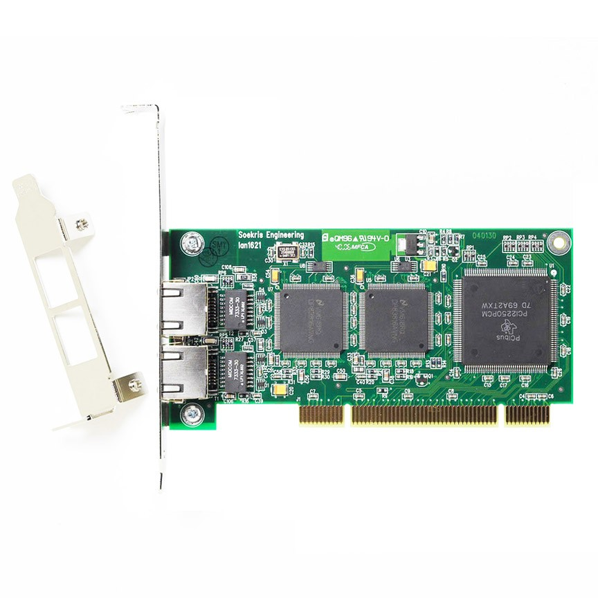
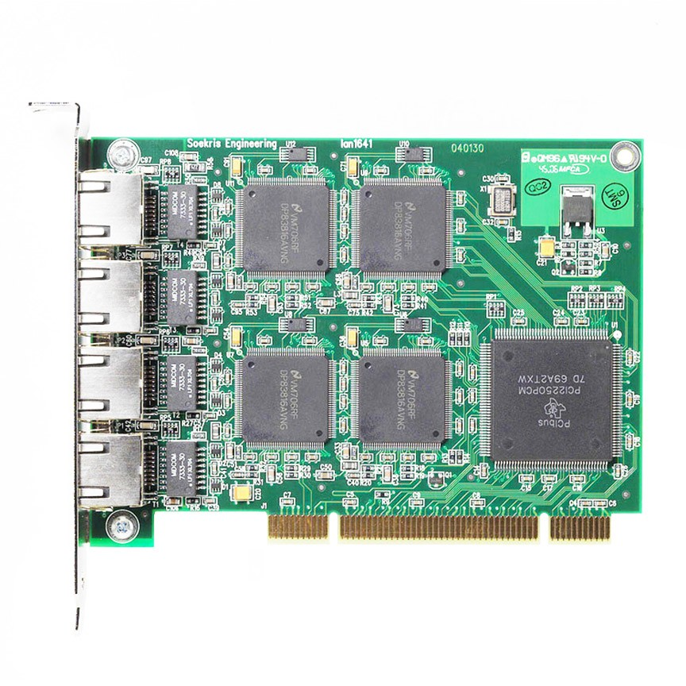

# lan16x1 Product Range

These two multiport ethernet adapters deliver excellent performance at competitive prices.

The lan1621 is a short low profile PCI board with two independent ethernet controllers, perfect for space limited systems and 2U servers. The lan1641 is a short standard profile PCI board with four independent ethernet controllers, for systems where the highest number of ports are needed. Both boards can also be used for adding additional ethernet ports to the Soekris net4501, net4801, and net5501 communication computers. Either board can be purchased in a bundle with the net4801, including an integrated case. The net5501-60 or -70 Board and Case can accept either board as well.

## Specifications
* National Semicondutor DP83816 ethernet controller chips
* Texas Instruments PCI2250 PCI-PCI bridge chip
* High performance PCI busmaster interface with large buffers and interrupt holdoff
* Shielded RJ-45 connectors with LED's for speed and activity
* 33 Mhz, 32 bit PCI 2.3 expansion cards, universal for 3.3V and 5V power and signaling
* IEEE 802.3u 10 Mbps 10BaseT and 100 Mps 100BaseTX, half and full duplex
* IEEE 802.3u Auto-Negotiation
* IEEE 802.3x Full duplex flow control
* Two ports short low profile PCI board, power max 1.5W when 3.3V is available
* Four ports short standard PCI board, power max 2.8W when 3.3V is available
* Operating temperature 0-60 °C

