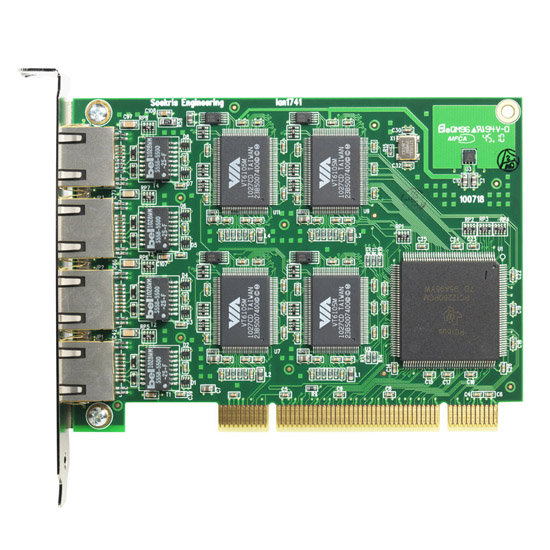
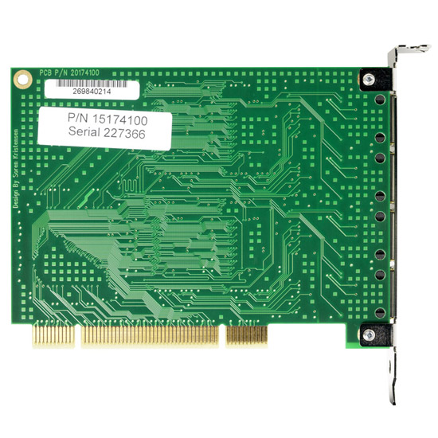

# lan1741

The lan1741 is a short standard profile PCI board with four independent ethernet controllers. It delivers excellent performance at a competitive price, and has been designed for long term availability for the embedded market. It is well suited for adding additional ethernet ports to the Soekris net5501 communication computers.

## Specifications
•  VIA VT6105M ethernet controller chips
•  Texas Instruments PCI2250 PCI-PCI bridge chip
•  High performance PCI busmaster interface with large buffers and interrupt moderation
•  Shielded RJ-45 connectors with LED's for speed and activity
•  33 Mhz, 32 bit PCI 2.3 expansion cards, universal signaling for 3.3V power
•  IEEE 802.3u 10 Mbps 10BaseT and 100 Mps 100BaseTX, half and full duplex
•  IEEE 802.3u Auto-Negotiation
•  IEEE 802.3x Full duplex flow control
•  IEEE 802.1q Multiple VLAN support
•  Support Auto-MDIX function
•  UDP, TCP/IP checksum offload for IPv4 frames
•  All ports protected to 700W/40A Surge
•  Four ports short standard PCI board, power max 2.0W from 3.3V
•  Operating temperature 0-60 °C

