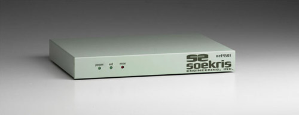
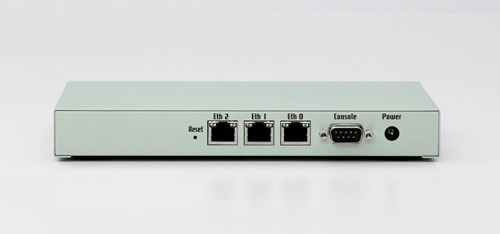
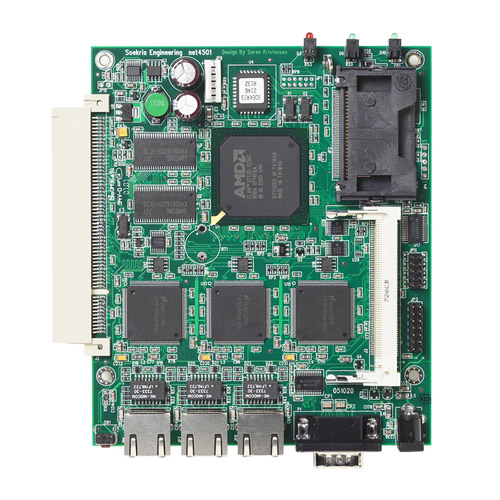

# net4501 Product Range

This compact, low-power, low-cost, advanced communication computer is based on a 133 Mhz 486 class processor. It has three 10/100 Mbit ethernet ports, up to 64 Mbyte SDRAM main memory and uses a CompactFlash module for program and data storage. It can be expanded using a MiniPCI type III board and a low-power standard PCI board.

It has been optimized for use as a Firewall and VPN Router, but has the flexibility to take on a whole range of different functions as a communication appliance. The board is designed for long life and low power.

Please note that this product has reached end of life status. The net4501 board is no longer in stock, but the accessories below are still available.

**Standard Configuration:**
* **133 Mhz CPU, 64 Mbyte SDRAM, 3 Ethernet Ports**

## SSpecifications
•  100 or 133 Mhz AMD ElanSC520
•  16 to 64 Mbyte SDRAM, soldered on board
•  1 Mbit BIOS/BOOT Flash
•  CompactFLASH Type I/II socket
•  1 to 3 10/100 Mbit Ethernet ports, RJ-45
•  1 Serial port, DB9. (optional 2nd serial port)
•  Power LED, Activity LED, Error LED
•  Mini-PCI type III socket. (t.ex for optional hardware encryption.)
•  PCI Slot, right angle 3.3V only. (t.ex for optional WAN board.)
•  8 bit general purpose I/O, 14 pins header
•  Hardware watchdog
•  Board size 4.85" x 5.7"
•  Power using external power supply is 6-20V DC, max 10 Watt
•  Option for 5V supply using internal connector
•  Operating temperature 0-60 °C

## Software
•  comBIOS for full headless operation over serial port
•  PXE boot rom for diskless booting
•  Designed for FreeBSD, NetBSD, OpenBSD and Linux
•  Runs most realtime operating systems

