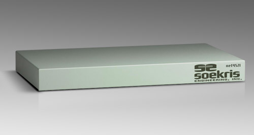
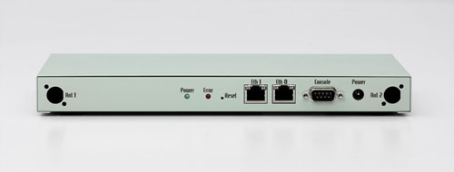
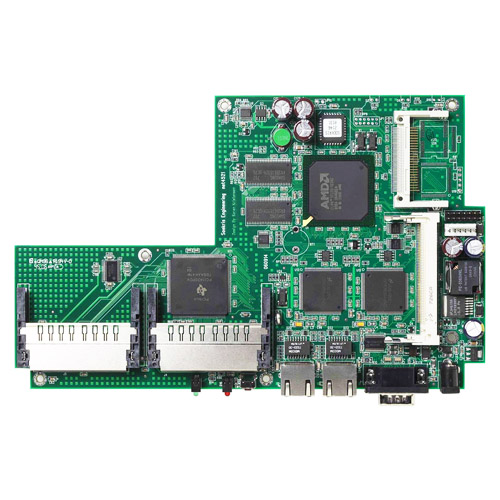

# net4521 Product Range

This reliable, compact, low-power, low-cost, advanced communication computer is based on a 133 Mhz 486 class processor. It has two 10/100 Mbit ethernet ports, up to 64 Mbyte SDRAM main memory and uses a CompactFlash module for program and data storage. It can be expanded using a MiniPCI type III board and up to two PC-Card/Cardbus adapters.

It has been optimized for use as wireless router using PC-Card wireless adapters, but has the flexibility to take on a whole range of different functions as a communication appliance.

Please note that this product has reached end of life status. The net4521 board is no longer in stock, but the accessories below are still available.

Please note that the available standard case has cutouts for two RP-TNC Jacks for the external antennas, but does not include the connectors and cables. Also, we sell both the standard power supply and well as a PoE version. Please make sure you order the correct power supply for your needs.

**Standard Configuration:**
* **133 Mhz CPU, 64 Mbyte SDRAM, 2 Ethernet Ports, 2 PC-Card slots**

## Specifications
* 100 or 133 Mhz AMD ElanSC520
* 16 to 64 Mbyte SDRAM, soldered on board
* 1 Mbit BIOS/BOOT Flash
* CompactFLASH Type I/II socket
* 1 or 2 10/100 Mbit Ethernet ports, RJ-45
* 1 Serial port, DB9.
* Power LED, Activity LED, Error LED
* Mini-PCI type III socket. (t.ex for optional hardware encryption.)
* 2 PC-Card/Cardbus slots, for wireless adapters
* 8 bit general purpose I/O, 14 pins header
* Hardware watchdog
* Board size 9.2" x 5.7"
* Power using external power supply is 11-56V DC, max 14 Watt
* Option for 5V supply using internal connector
* Supports Power over Ethernet according to the 802.3af standard
* Operating temperature 0-60 °C

## Software
* comBIOS for full headless operation over serial port
* PXE boot rom for diskless booting
* Designed for FreeBSD, NetBSD, OpenBSD and Linux
* Runs most realtime operating systems

