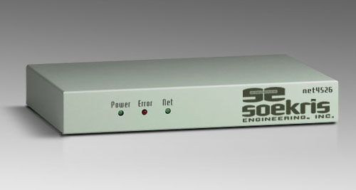
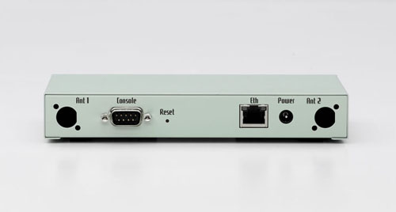
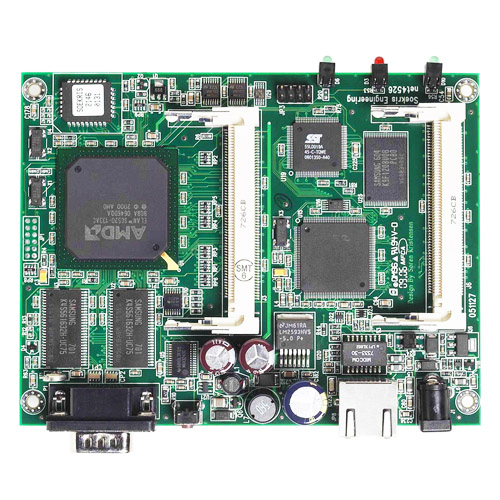

# net4526 Product Range

This compact, low-cost, advanced communication computer is based on a 100 or 133 Mhz 486 class processor. It has one 10/100 Mbit ethernet ports, up to 128 Mbyte SDRAM main memory and uses a CompactFlash circuit soldered onboard for program and data storage. It can be expanded using up to two MiniPCI type III boards.

It has been optimized for use as wireless router using Mini-PCI wireless boards, but has the flexibility to take on a whole range of different functions as a communication appliance. The board is designed for long life, low power and extended temperature range.

Please note that this product has reached end of life status. The net4526 board is no longer in stock, but the accessories below are still available.

## Specifications
•  100 or 133 Mhz AMD ElanSC520
•  16 to 128 Mbyte SDRAM, soldered on board
•  1 to 4 Mbit BIOS/BOOT Flash
•  Soldered CompactFLASH, 16 Mbyte to 256 Mbyte
•  CompactFLASH Type I/II socket
•  1 10/100 Mbit Ethernet ports, RJ-45
•  1 Serial port, DB9
•  Power LED, Activity LED, Error LED
•  1 to 2 Mini-PCI type III sockets
•  5 bit general purpose I/O, 14 pins header
•  Hardware watchdog
•  Board size 4.0" x 5.2"
•  Power using external power supply is 11-56V DC, max 10 Watt
•  Supports Power over Ethernet according to the 802.3af standard
•  Operating temperature 0-60 °C, typical -30 to 60 °C

## Software
•  comBIOS for full headless operation over serial port
•  PXE boot rom for diskless booting
•  Designed for FreeBSD, NetBSD, OpenBSD and Linux
•  Runs most realtime operating systems

