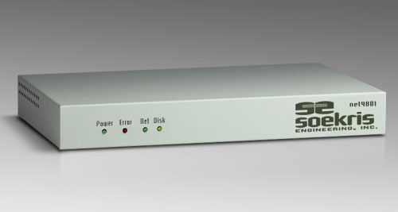
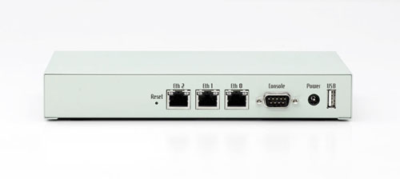
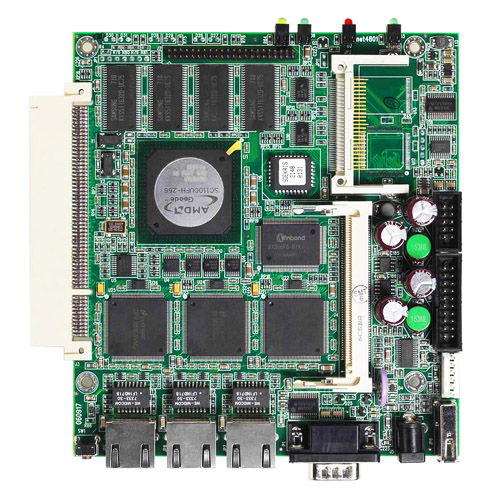

# net4801 Product Range

This compact, low-power, low-cost, advanced communication computer is based on a 233 Mhz 586 class processor. It has one 10/100 Mbit ethernet ports, up to 256 Mbyte SDRAM main memory and uses a CompactFlash circuit soldered onboard for program and data storage.

It can be expanded using up to two MiniPCI type III boards. It has been optimized for use as wireless router using Mini-PCI wireless boards, but has the flexibility to take on a whole range of different functions as a communication appliance. The board is designed for long life and low power.

Please note that this product has reached end of life status. The net4801 board is no longer in stock, but the accessories below are still available.

## Specifications
•  233 Mhz NSC SC1100 single chip processor
•  32 to 256 Mbyte SDRAM, soldered on board
•  4 Mbit BIOS/BOOT Flash
•  CompactFLASH Type I/II socket
•  UltraDMA-33 interface with 44 pins connector for 2.5" Hard Drive
•  1 to 3 10/100 Mbit Ethernet ports, RJ-45
•  2 Serial ports, DB9 and 10 pins header
•  USB 1.1 interface
•  Power LED, Activity LED, Error LED
•  Mini-PCI type III socket. (t.ex for optional hardware encryption.)
•  PCI Slot, right angle 3.3V signaling only
•  12 bit general purpose I/O, 20 pins header
•  Temperature and voltage monitor
•  Hardware watchdog
•  Board size 5.2" x 5.7"
•  Power using external power supply is 6-20V DC, max 15 Watt
•  Option for 5V supply using internal connector
•  Operating temperature 0-60 °C

## Software
•  comBIOS for full headless operation over serial port
•  PXE boot rom for diskless booting
•  Designed for FreeBSD, NetBSD, OpenBSD and Linux
•  Runs most realtime operating systems

