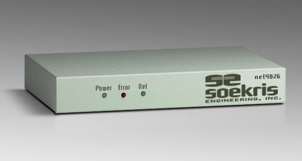
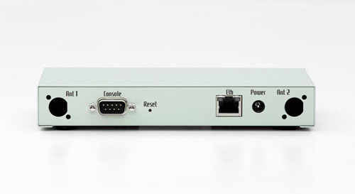
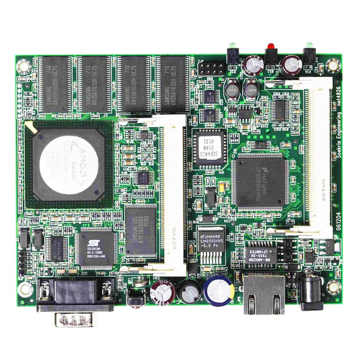

# net4826  Product Range

This compact, low-power, low-cost, advanced communication computer is based on a 233-266 Mhz 586 class processor. It has one 10/100 Mbit ethernet ports, up to 256 Mbyte SDRAM main memory and uses a CompactFlash circuit soldered onboard for program and data storage. It can be expanded using up to two MiniPCI type III boards.

It has been optimized for use as wireless router using Mini-PCI wireless boards, but has the flexibility to take on a whole range of different functions as a communication appliance. The board is designed for long life, low power and extended temperature range.

Please note that this product has reached end of life status.

Please note that this product has reached end of life status. The net4826 board is no longer in stock, but the accessories below are still available.

Please note that the available standard case has cutouts for two RP-TNC Jacks for the external antennas, but does not include the connectors and cables.

**Standard Configurations:**
* **net4826-40: 233 Mhz CPU, 64 Mbyte SDRAM, 1 Ethernet Port, 128 Mbyte soldered CF - EOL - Permanently Out of Stock**
* **net4826-48: 233 Mhz CPU, 128 Mbyte SDRAM, 1 Ethernet Port, 256 Mbyte soldered CF - EOL - Permanently Out of Stock**

## Specifications
* 233 Mhz AMD Geode SC1100
* 32 to 256 Mbyte SDRAM, soldered on board
* 4 Mbit BIOS/BOOT Flash
* Soldered CompactFLASH, 128 Mbyte
* 1 10/100 Mbit Ethernet port, RJ-45
* 1 Serial port, DB9
* Power LED, Activity LED, Error LED
* 2 Mini-PCI type III sockets
* 5 bit general purpose I/O, 8 pins header
* Hardware watchdog and temperature sensor
* Hard/Soft reset switch
* Board size 4.0" x 5.2"
* Power using external power supply is 11-56V DC, max 12 Watt
* Supports Power over Ethernet according to the 802.3af standard
* Operating temperature 0-60 °C, typical -30 to 60 °C

## Software
* comBIOS for full headless operation over serial port
* PXE boot rom for diskless booting
* Designed for FreeBSD, NetBSD, OpenBSD and Linux
* Runs most realtime operating systems

