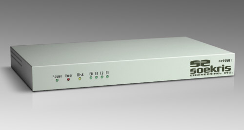
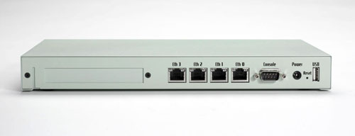
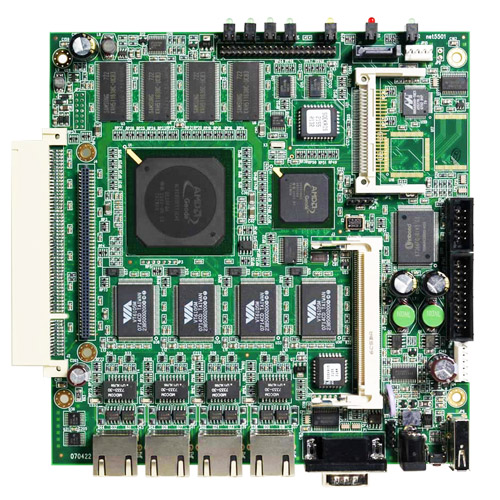

# net5501 Product Range

This compact, low-power, low-cost, advanced communication computer is based on an up to 500 Mhz 586 class processor. It has four 10/100 Mbit ethernet ports, up to 512 Mbyte DDR-SDRAM main memory and uses a CompactFlash module for program and data storage. It can be expanded using a MiniPCI type III board, a hard drive and one or two low-power standard PCI board.

It has been optimized for use as a Firewall, VPN Router, Internet Gateway and VoIP PBX, but has the flexibility to take on a whole range of different functions as a communication appliance. The board is designed for long life and low power.

It is available in any volume in the standard version, and as board only or with a small metal box (11.38"W x 6.75"D x 1.29"H) and various power supplies, or a 1U 19" rackmount case (17"W x 6.75"D x 1.69"H) with internal power supply included. The board can be customized according to requirements when ordering higher volume. With an HDD mounting kit you can install a 2.5" HDD on top of the board.

**Standard Configurations:**
* **net5501-60: 433 Mhz CPU, 256 Mbyte DDR-SDRAM, 4 Ethernet Ports**
* **net5501-70: 500 Mhz CPU, 512 Mbyte DDR-SDRAM, 4 Ethernet Ports**

## Specifications
•  433 to 500 Mhz AMD Geode LX single chip processor with CS5536 companion chip
•  128 to 512 Mbyte DDR-SDRAM, soldered on board
•  4 Mbit BIOS/BOOT Flash
•  CompactFLASH Type I/II socket.
•  UltraDMA-100 interface with 44 pins connector for 2.5" Hard Drive
•  Serial ATA 1.0 interface for Hard Drive, with +5V and +12V power header
•  1 to 4 VIA VT6105M 10/100 Mbit Auto MDIX Ethernet ports, RJ-45, protected to 700W/40A Surge
•  2 Serial ports, DB9 and 10 pins internal header
•  USB 2.0 interface, one internal, one external port
•  Power LED, Disk LED, Error LED, Network LED's
•  Mini-PCI type III socket. (for t.ex. hardware encryption or wireless controller)
•  PCI Slot, right angle 3.3V signaling only, dual PCI slot option
•  12 bit general purpose I/O, 20 pins header
•  Temperature and voltage monitor
•  Hardware watchdog
•  Board size 6.3" x 6.5"
•  Power using external power supply is 6-25V DC, max 20 Watt, protected with TVS
•  Option for 5V supply using internal connector
•  Operating temperature 0-60 °C

## Cases Available
•  Standard case with 1 PCI slot, 11.38"W x 6.75"D x 1.29"H
•  1U 19" rackmount case, 17"W x 6.75"D x 1.69"H

## Software
•  comBIOS for full headless operation over serial port
•  PXE boot rom for diskless booting
•  Designed for FreeBSD, NetBSD, OpenBSD and Linux
•  Runs most realtime operating systems

