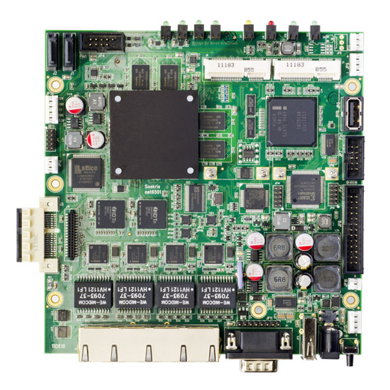
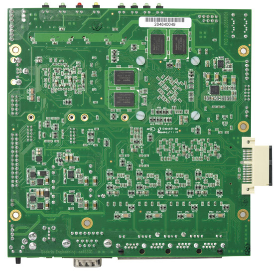

# net6501 Product Range

This compact, low-power, low-cost, advanced communication computer is based on an up to 1.6 Ghz Intel Atom E6xx series processor. It has four 10/100/1000 Mbit ethernet ports, up to 2 Gbyte DDR2-SDRAM main memory and uses a USB flash drive or mSATA module for program and data storage. It can be expanded using MiniPCI-Express boards, hard drives and low-power standard PCI-Express boards.

It has been optimized for use as a Firewall, VPN Router, Internet Gateway and Small Server Applications, but has the flexibility to take on a whole range of different functions as a communication appliance. The board is designed for long life and low power.

It is available in any volume in the standard version, and as board only, with a small metal box and power supply (sold separately), or a 1U 19 inch rackmount case and internal power supply. The board can be customized according to requirements when ordering higher volume.

**Standard Configurations:**
* **net6501-30: 600 Mhz CPU, 512 Mbyte DDR2-SDRAM, 4 Gigabit Ethernet Ports**
* **net6501-50: 1 Ghz CPU, 1 Gbyte DDR2-SDRAM, 4 Gigabit Ethernet Ports**
* **net6501-70: 1.6 Ghz CPU, 2 Gbyte DDR2-SDRAM, 4 Gigabit Ethernet Ports**

## Specifications
* 600 Mhz to 1.6 Ghz Intel Atom E6xx single chip processor with EG20T companion chip
* 512 to 2048 Mbyte DDR2-SDRAM, soldered on board
* 8 Mbit BIOS/BOOT Flash
* Internal Low Profile USB socket, bootable
* 2x SATA 3 Gbit interfaces with +5V and +12V power header
* 4x Intel 82574L Gigabit Ethernet ports, Auto-MDIX RJ-45, protected to 700W/40A Surge
* 2x Serial ports, DB9 and 10 pins internal header
* USB 2.0 interface, 2x internal, 1x external port, bootable
* Power LED, Disk LED, Error LED, Status LED, Network LED's
* 1 Full Mini-PCI Express shared with mSATA socket.
* 1 USB only Mini-PCI Express shared with mSATA socket
* 2x PCI Express Slots, right angle
* 16 bit general purpose I/O, 24 pins header, connected to FPGA
* Temperature and voltage monitor, fan controller
* Light Management Microcontroller
* Board size 5.7" x 5.8"
* Power using external power supply is 6-25V DC, max 30 Watt, protected with TVS
* NiMH battery backup connector with charge and monitoring
* Option for 5V supply using internal connector
* Operating temperature 0-60 °C

## Cases Available
* Standard case with 1 PCI-Express slot, 11.4"W x 6.11"D x 1.41"H
* 1U 19" rackmount case, 17"W x 6.11"D x 1.69"H

## Software
* comBIOS for full headless operation over serial port
* PXE boot rom for diskless booting
* Designed for FreeBSD, NetBSD, OpenBSD and Linux
* Runs most realtime operating systems

