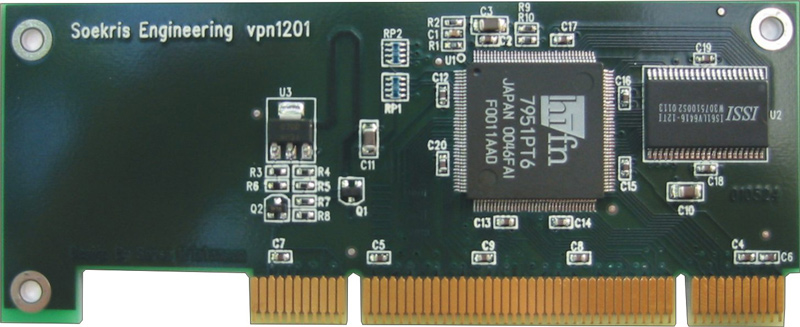
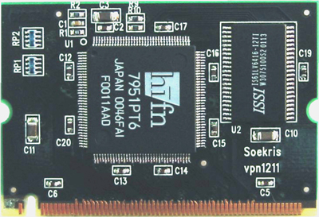

# vpn1201 and vpn1211

These two small hardware security accelerators deliver excellent performance at a value price, off loading the CPU of the computing intensive tasks of encryption and compression. They are perfect for low cost and low power VPN Routers like the net4501, and can deliver at throughput of up to 64 Mbps doing encryption and compression, more than enough for use at T1, E1, DSL and Ethernet speeds.

They are available in two versions with the same functionality and performance, one for the standard PCI bus, and one for the Mini-PCI type III form factor, perfect for use in the net4501.

**Standard Configuration:**
* **133 Mhz CPU, 64 Mbyte SDRAM, 3 Ethernet Ports**

## SSpecifications
* Hi/fn 7951 security accelerator chip
* 128 Kbyte high speed buffer memory
* Total system throughput at up to 64 Mbps
* Compression, LZS and MPPC at 43 to 99 Mbps
* Encryption, DES, Triple-DES and RC4 at 70 to 188 Mbps
* Authentication, SHA-1 and MD5 at 66 to 79 Mbps
* Public Key, RSA and DH, 2 to 8 connections/sec using 1024 bit keys
* Hardware random number generator
* vpn1201: Low Profile PCI, universal board for 3.3V and 5V systems
* vpn1211: Mini-PCI type III form factor
* Power max 1.2 Watt
* Operating temperature 0-60 °C

## Software
* OpenBSD fully supported in latest release.
* FreeBSD and Linux support under development

