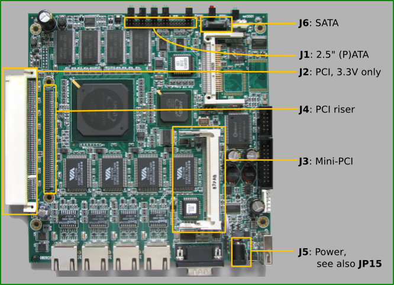
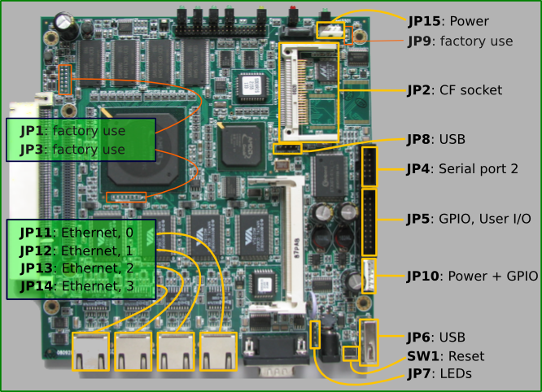
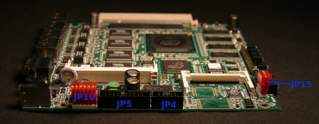
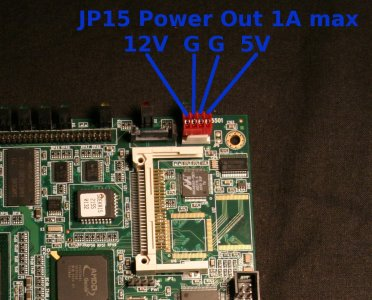

# 5501 Interfaces

The Soekris 5501 board has been shipping since the summer of 2007, yet as of this writing (February 2008), there is no manual for it. Unfortunately, the hardware is different from the predecessor, the 4801 board. The best reference for the 5501 is still the [4801 hardware manual from Soekris](https://web.archive.org/web/20180811114021/http://www.soekris.com/Manuals/net4801_manual.pdf "http://www.soekris.com/Manuals/net4801_manual.pdf"); this web page documents slight differences between the 5501 and the 4801, concentrating on the area of external interfaces. Cortex systems has a [high resolution image](https://web.archive.org/web/20180811114021/http://www.cortexsystems.dk/shop/images/net5501_top.jpg "http://www.cortexsystems.dk/shop/images/net5501_top.jpg") of the 5501 on their web site.

In the following, all references are seen from the TOP of the board. The "front" is defined as the side with the LEDs, the "back" the side with the four Ethernet connectors; this means that the "right" of the board is the side with the PCI connector, and the "left" the side with the power and GPIO connectors.

*All TODO items are in italics.*

*TODO: Many connectors in the following list are actually known, but I don't happen to have the complete documentation with me. So I'll document what I can find right now, and add the rest later.*

## Connectors

 **J1** - (P)ATA
 2.5" (P)ATA connector for laptop style disks. Located behind the four green leds on the front. Pin one is away from CF connector, marked by white arrown in silk-print.

 **J2** - PCI connector
 3.3V PCI cards only. If you card does not fit with the component side upwards, your card is 5V and does not fit. Do not try anyway.

 **J3** - Mini PCI connector
 3.3 V PCI.

 **J4** - PCI riser
 (not released yet). Center right, parallel to the PCI connector: very large 2-row 2mm header.

 **J5** - DC Input Jack
 The 2.1mm DC Power Jack should be used for connecting a small wall mount unregulated power adapter, supplying 6V-28V DC at 15 VA, with a 5.5mm outside, 2.1mm inside female power plug with plus at center pin. It is protected against reverse polarity. Please note that standard unregulated power transformers can supply much higher voltage that the specified nominal voltage, so when using such a type it’s recommended to use one that is specified for 16V DC or less.

 **J6** - SATA connector
 Near the front, right behind the red LED.

## Jumpers

**JP1** - Factory use 
 Front right corner, right next to the front edge of the PCI connector: 14-pin 0.100" 2-row header.

 **JP2** - CF socket
 Compact Flash.

 **JP3** - Factory use 
 Center left, right behind the large CPU chip, 7-pin single-row 0.100" header.

 JP4 - COM2 serial port
| DB9 Pin | Function | Pin | Pin | Function | DB9 Pin |
| ------- | -------- | --- | --- | -------- | ------- |
| 1 | DCD | 1 | 2 | DSR | 6 |
| 2 | RXD | 3 | 4 | RTS | 7 |
| 3 | TXD | 5 | 6 | CTS | 8 |
| 4 | DTR | 7 | 8 | RIN | 9 |
| 5 | GND | 9 | 10 | +5 V Pwr | -- |
*Common db9 connector* 

 **JP4** - COM2 serial port 
 Shrouded 10-pin 2-row 0.100" header (pictured below). Pin 1 is towards the CF socket and labeled by "Pin1" text in silk-print.

 JP5 - GPIO
| PC87366 Pin | Function | Pin | Pin | Function | PC87366 Pin |
| ----------- | -------- | --- | --- | -------- | ----------- |
| -- | +3.3V Power | 1 | 2 | +5V Power | -- |
| GPIO 20, 117 | GPIO 0 | 3 | 4 | GPIO 1 | GPIO 21, 118 |
| GPIO 22, 119 | GPIO 2 | 5 | 6 | GPIO 3 | GPIO 23, 120 |
| GPIO 24, 121 | GPIO 4 | 7 | 8 | GPIO 5 | GPIO 25, 122 |
| GPIO 26, 123 | GPIO 6 | 9 | 10 | GPIO 7 | GPIO 27, 124 |
|  -- | GND | 11 | 12 | GPIO 8 | GPIO 4, 6 |
|  GPIO 5, 7 |  GPIO 9 |  13 |  14 |  GND |  -- |
| GPIO 13, 55 | GPIO 10 | 15 | 16 | GPIO 11 | GPIO 12, 54 |
|  -- | GND | 17 | 18 | RXD | SIN 2, 105 |
| SOUT 2, 107 | TXD | 19 | 20 | GND | -- |
*All the JP5 GPIO pins provide 3.3V out and are 5V input tolerant.*

 **JP5** - GPIO / User IO
 Shrouded 20-pin 2-row 0.100" header (pictured below). See the [4801 hardware manual](https://web.archive.org/web/20180811114021/http://www.soekris.com/manuals/net4801_manual.pdf "http://www.soekris.com/manuals/net4801_manual.pdf") for details. JP5 is connected directly to the PC87366 Multi-IO chip, see the [PC87366 data sheet](https://web.archive.org/web/20180811114021/http://www.datasheetcatalog.com/datasheets_pdf/P/C/8/7/PC87366.shtml "http://www.datasheetcatalog.com/datasheets_pdf/P/C/8/7/PC87366.shtml") for more information. 

 JP5 Pin 2 is able to supply up to 1A of current, but the physical pin or attached cable might limit that due to size. All the JP5 GPIO pins provide 3.3V out and are 5V input tolerant. JP5 supplies regulated current to power drives. 

 **JP6** - USB connector
 Back edge right.

 **JP7** - LEDs 
 Back edge, between P1 serial connector and power connector: 4-pin single-row 0.100" header. Pin1 is common (+3.3V), pin2 power, pin3 error, pin4 HDD - low when active.

 JP7 Pins
| Pin | Function | --- |
| --- | -------- | --- |
| 1 | +3.3 V | Common. |
| 2 | Power On LED | This green LED will be on when there is applied power to the board. |
| 3 | Error LED | This red LED is connected to the CS5536 companion chip GPIO6, ball D2. It is connected so that it will be on at power on, and can then be turned off and on by software control. When programming GPIO6 with a 0, it will be off. The BIOS will normally turn it off just before booting an operating system. |
| 4 | Disk Activity LED | This yellow LED will be on when there is disk activity, either by the CompactFlash module or the optional Hard Disk. |
*low when active*

 **JP8 pins**
| Pin | Function |
| --- | -------- |
| 1 | Vcc |
| 2 | Data- |
| 3 | Data+ |
| 4 | Ground |

 **JP8** - USB port
 Left center of the board, right next to the CF connector: 4-pin 0.100" single row header. Pin1 marked by "pin1" text in silk-print. Second USB connector, standard USB extension cable pinout: 1=Vcc, 2=Data-, 3=Data+, 4=ground. Whether this second USB port is USB 1.0 or 2.0, and whether it is capable of fast transfers: Read the discussion on soekris-tech. 
 *Warning*: Because USB extender cables stick up considerable, this connector can not be used if a hard disk mounting kit is installed. Ralphbsz' solution is to solder a right-angle header to the existing header, and lay the USB extension cable flat across the CF connector. 

 **JP9** - Factory use
 Front left corner: 2-pin 0.100" header, not populated from the factory. 

 JP10 - DC Power + GPIO
| Pin | Function |
| --- | -------- |
| 1 | GND |
| 2 | GND |
| 3 | VPWR |
| 4 | +5V |
| 5 | GPIO 4 |
| 6 | GPIO 0 |

 **JP10** - Power+GPIO
 6-pin MTA100 connector (pictured below). See NET4801 manual for details. Digikey A31084-ND (MFG p/n 3-640440-6). JP10 pin 4 able to supply up to 1A. JP10 can be used as an alternate point to attach a power supply. 

 **JP11** through **JP14** - Ethernet 
 RJ45, Back edge.

 **JP15** - Disk power connector
 4-pin MTA100 connector (pictured below). Matches 3.5" floppy disk power pinout. Digikey A31082-ND (MFG p/n 3-640440-4). Pin 1 able to supply up to 1A.

 **P1** - COM1 serial port
 Back edge of board, 9-pin female D connector: Serial port. Industry standard pinout.

 **SW1** - Reset Button
 Back edge of board, between serial port and power connector. According to BIOS setting this can either reset the machine directly, or you can take it under software control and read it as a general-purpose input (GPIO). (However, the details of how to do that are not yet officially documented.) 

Button status can be checked via CS5536 GPIO25, RS-trigger latch can be controlled via CS5536 GPIO24.

## Images

JP10 (with MTA100 Connector), JP5 and JP4

JP15 Details (shown with MTA100 connector)

